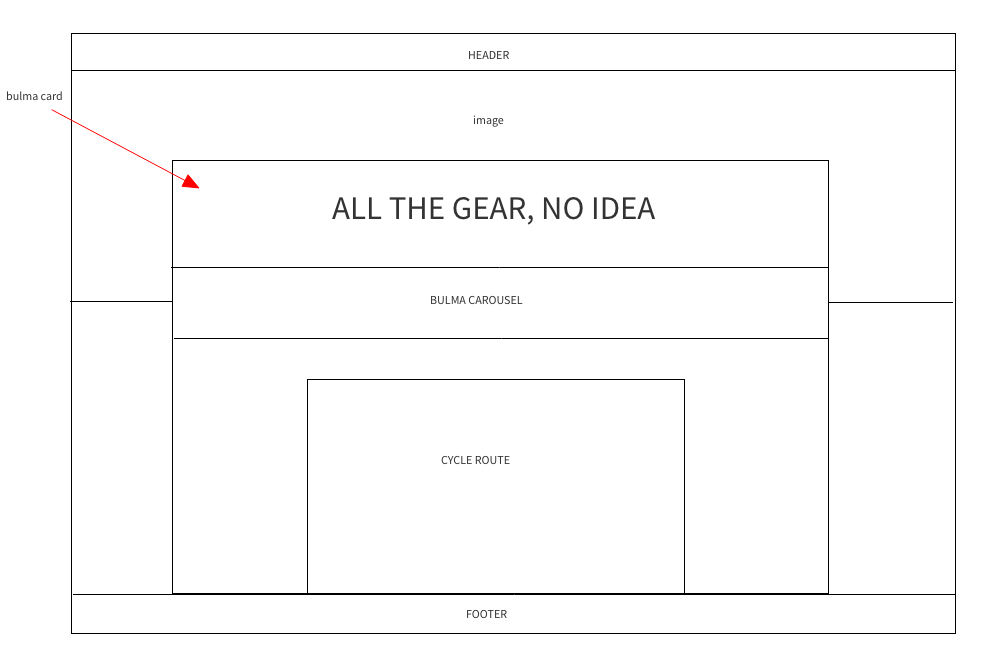
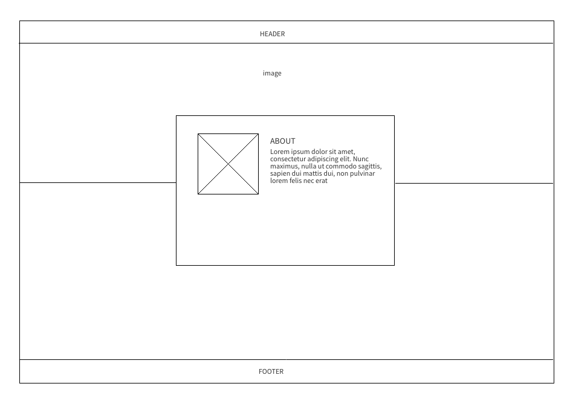
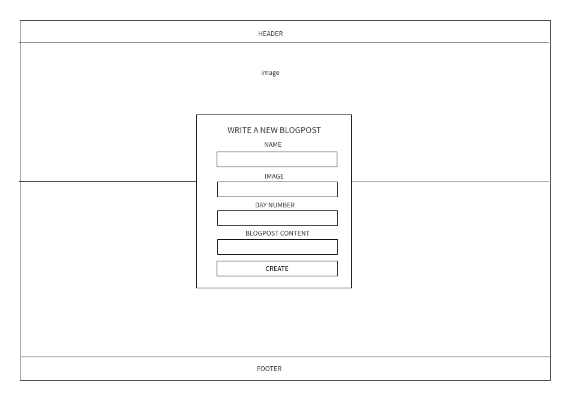

# All the Gear, No Idea

All the Gear, No Idea is a remake of the cycling blog that I wrote when I cycled across Canada in the summer of 2017. Users can sign in to write, edit, delete and comment/rate blogposts.

All the Gear, No Idea is my second project from General Assembly's Web Development Immersive course. It was an individual project built within the space of a week. This project was my first attempt at backend technologies and took place over week 6 of the course.

Launch on [Heroku](https://cross-canada-cycle-app.herokuapp.com/) or check out the GitHub
[Repo](https://github.com/zoebarrington/wdi-project-two).

## Course Curriculum:
### Week 5: Module Two   
* Node.js
* Express.js
* EJS  
* MongoDB
* User Authentication

*Full course curriculum available at bottom of page*

***

## Brief
To design a full-stack Node app that must include:

* At least two models
* RESTful routes
* User authentication
* Allows users to edit, delete and add posts
* Is styled with Bulma, but doesn't look like Bulma
* Deployed on Heroku  
* EJS for template creation
* CSS framework on the front-end

**Timeframe:** 1 week(October 2018)

## Concept

We were given three options to choose from - an Instagram clone, a restaurant review or a blogging site. I chose the blogging site and recreated the Wordpress blog I had written when I cycled across Canada.

## Home Page

## About Page  

## Login Page  

## Index Page  

## Create Page   

## Show Page  

## Technologies Used
- JavaScript (ECMAScript 6)
- SCSS with Bulma and CSS animation
- Node.js
- MongoDB
- bcrypt: v3.0.0
- bluebird: v3.5.1
- body-parser: v1.18.3
- ejs: v2.6.1
- express-ejs-layout: 2.4.0
- express-session: v1.15.6
- method-override: v3.0.0
- mongoose: v5.2.5
- morgan: v1.9.0
- Git
- GitHub
- Heroku
- Google Fonts  
- Fontawesome

## Approach Taken

I had learnt from my first project that it was essential to reach MVP as soon as possible. With this in mind, I set out a clear plan of what MVP consisted of, using wireframes (see below).

Once I had reached MVP, I then set out to add features, animations and styling to my site.

### Wireframes

## Home Page  

#### About Page   

### Create Page  

## Featured Piece of Code no.1

## Featured Piece of Code no.2

## Wins and Blockers

## Bugs/Moving Forward  
* Page features overlap nav bar when scrolling down
* Any logged in user can edit/delete posts

## Future Features

My initial idea was to build a cycling site where the index page would link to many different cycle touring blogs. However, given the time frame I needed to be realistic, and decided to start with just one blog, and add more if I had time.

Moving forward, I would like to develop my site into a blogging platform where any number of cyclists can add their blog to the site.

Other features I would like to add:
* Add maps so that readers can track where on the cycling route cyclists are
* Ensure that users can only edit/delete their own posts/comments
* Add messaging so that readers can contact the cyclists and ask questions (this is a feature I would like to add having completed the course and learnt how to do messaging)
