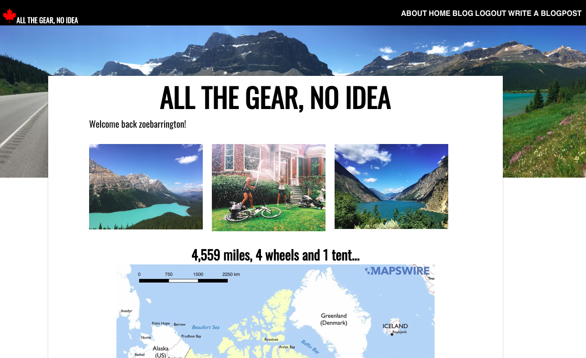
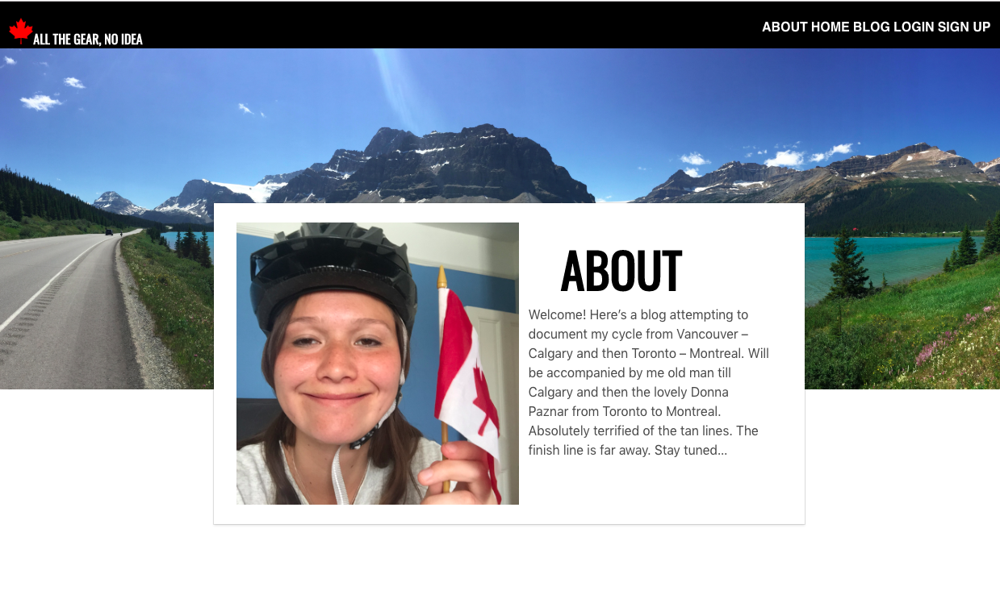
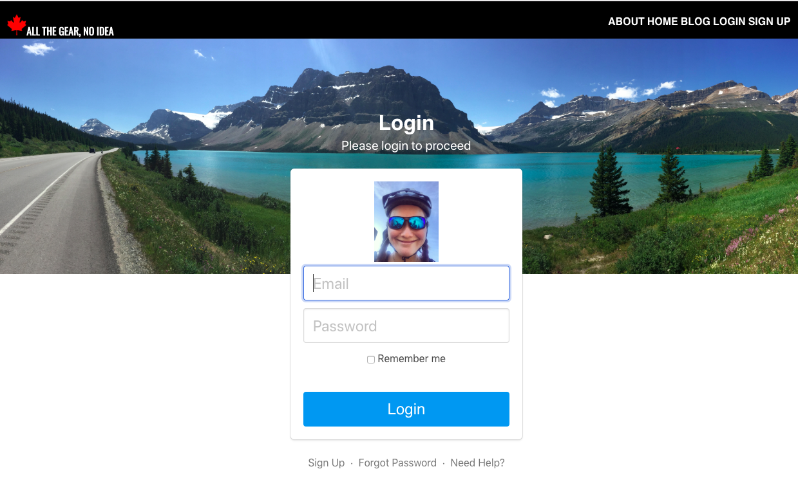
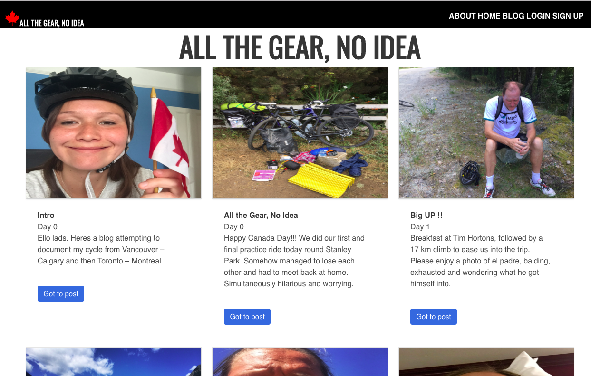
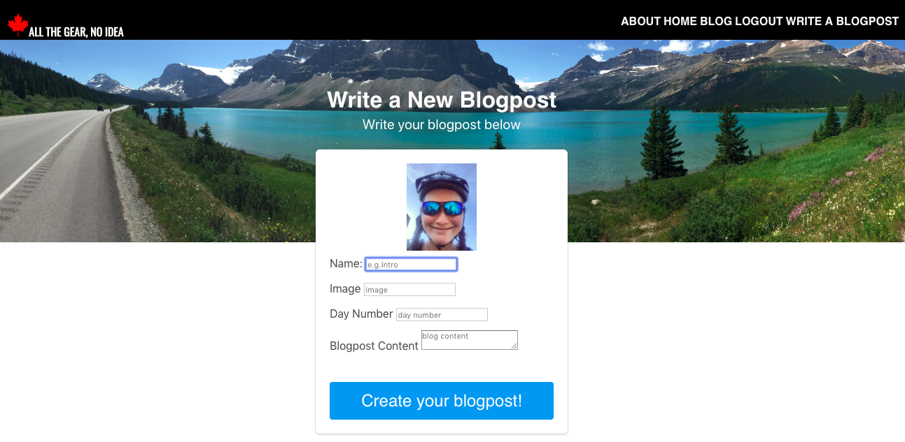
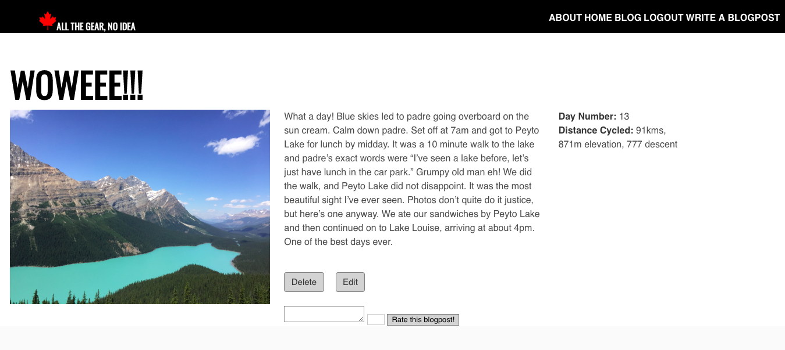

# All the Gear, No Idea
**[Heroku](https://cross-canada-cycle-app.herokuapp.com/)**

**[GitHub Repository](https://github.com/zoebarrington/wdi-project-two)**

All the Gear, No Idea is a remake of the cycling blog that I wrote when I cycled across Canada in the summer of 2017. Users can sign in to write, edit, delete and comment/rate blogposts.

All the Gear, No Idea is my second project from General Assembly's Web Development Immersive course. It was an individual project built within the space of a week. This project was my first attempt at backend technologies.

## Brief
To create a RESTful blog, restaurant review app or instagram clone. The app had to meet the following criteria:

* Has a user model and user authentication
* Allows users to edit, delete and add blogposts and blogpost comments
* Has a blog model and a comments/rating model
* Is styled with Bulma, but doesn't look like Bulma

## Home Page

## About Page  

## Login Page  

## Index Page  

## Create Page   

## Show Page  

## Technologies Used
- JavaScript (ECMAScript 6)
- SCSS with Bulma and CSS animation
- Node.js
- MongoDB
- bcrypt: v3.0.0
- bluebird: v3.5.1
- body-parser: v1.18.3
- ejs: v2.6.1
- express-ejs-layout: 2.4.0
- express-session: v1.15.6
- method-override: v3.0.0
- mongoose: v5.2.5
- morgan: v1.9.0
- Git
- GitHub
- Heroku
- Google Fonts  
- Fontawesome

## Approach Taken

### Wireframes

## Featured Piece of Code no.1

## Featured Piece of Code no.2
